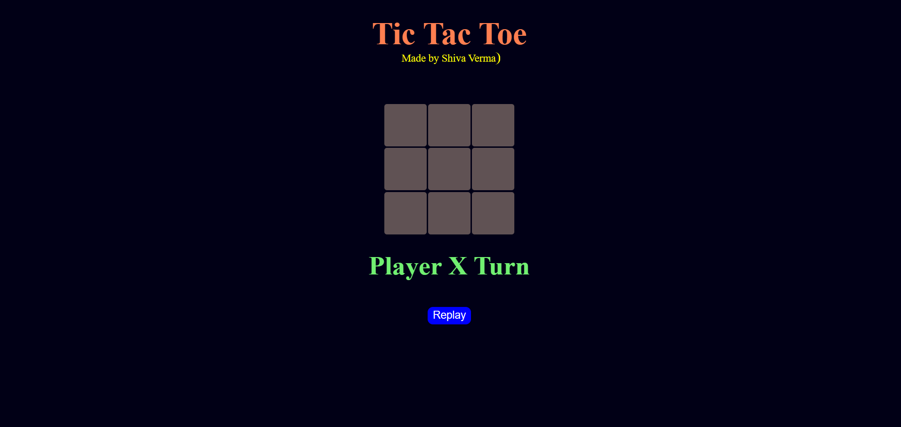
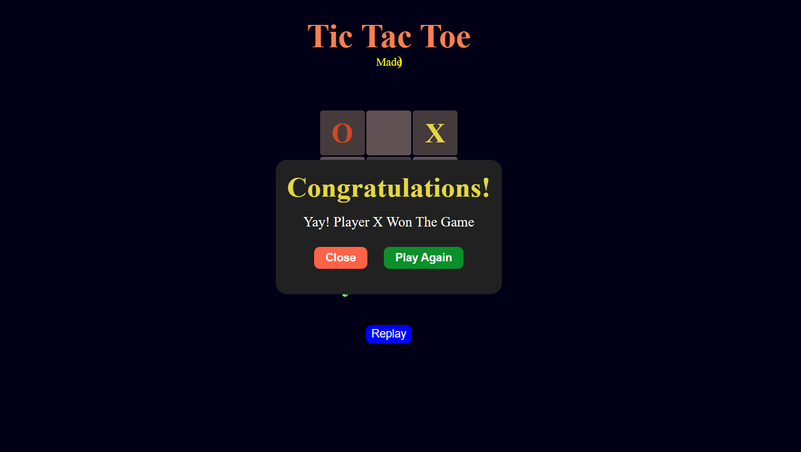
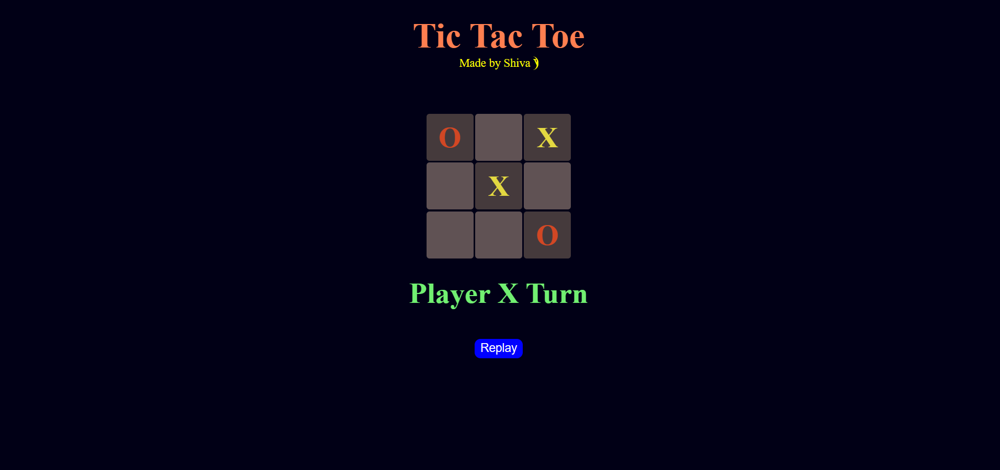

#  Tic Tac Toe Game

A simple, responsive **Tic Tac Toe** game built using **HTML**, **CSS**, and **JavaScript**.  
This game allows two players to take turns, displays the winner or a draw, and provides options to replay or restart.

---

##  Features

-  **Two-player gameplay** (Player X vs Player O)
-  Winner detection and popup message
-  Draw detection
-  Play Again / Replay options
-  Fully responsive design
-  Smooth animations & clean UI

---

##  Project Structure

```
TicTacToe/
│
├── index.html     # Main HTML file
├── style.css      # Styling for the game
└── script.js      # Game logic and interactivity
```

---

##  How to Run Locally

1. **Clone the repository**
   ```bash
   git clone https://github.com/shivaa05/Tic-Tac-Toe.git
   ```

2. **Navigate to the project folder**
   ```bash
   cd Tic-Tac-Toe
   ```

3. **Open the game in your browser**
   - Just double-click `index.html`  
   - Or open it in **VS Code** and use the **Live Server** extension

---

##  Technologies Used

- **HTML5**
- **CSS3**
- **JavaScript (Vanilla)**

---

##  How to Play

1. The game starts with **Player X**.
2. Click on any empty box to place your mark.
3. The turn automatically switches to the other player.
4. The game ends when:
   - One player has three marks in a row (horizontal, vertical, or diagonal).
   - All boxes are filled (draw).
5. A popup will appear showing the result.
6. Click **Play Again** or **Replay** to restart the game.

---

##  Screenshots

  
  
  

---

## License

This project is **open-source** and free to use.

---

💡 *Made with ❤️ by [Shiva Verma](https://github.com/shivaa05)*
